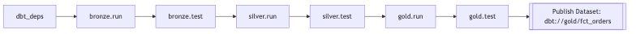

# Airflow + dbt + Snowflake + Docker + CICD Demo (Postgres‑backed) 🦊🐱

A production-ready Airflow + dbt + Snowflake data orchestration demo for rapid onboarding and reproducible pipelines.

Highlights
- Built reusable TaskGroups wrapping dbt run/test with backfill vars `{start_date,end_date}` to reduce boilerplate.
- Designed a layered ELT pipeline (Bronze → Silver → Gold) with tests as quality gates between layers.
- Serialized dbt CLI runs via Airflow Pool `dbt` to prevent `target/` and `dbt_packages/` race conditions.
- Published dataset `dbt://gold/fct_orders` for downstream Datasets-based orchestration.
- Integrated Great Expectations as automated data quality validation.

A stable, reproducible local data orchestration template: Apache Airflow for scheduling, dbt for modeling, Postgres as the Airflow metadata DB, and Snowflake as the warehouse. Comes with one‑command startup, health checks, regression validation, Great Expectations data quality, and Mailpit for notifications.


## Quick Start

Prerequisites: Docker Desktop ≥ 4.x, GNU Make, bash, curl

1) Credentials (local only, not committed)
- Copy `airflow/.env.example` to `airflow/.env` and fill Snowflake vars: `SNOWFLAKE_ACCOUNT`, `SNOWFLAKE_USER`, `SNOWFLAKE_PASSWORD`, `SNOWFLAKE_ROLE`, `SNOWFLAKE_WAREHOUSE`, `SNOWFLAKE_DATABASE`, `SNOWFLAKE_SCHEMA`.
- Optional: `ALERT_EMAIL` for failure notifications.

2) Start (pick one)
- `make up`                 # init + start, opens the UI
- `./launch.sh --init`      # one‑time init + start
- `make rebuild` or `./launch.sh --rebuild`  # rebuild images then start
- `make fresh`              # start clean, delete volumes (dangerous)
- Open `http://localhost:8080` (user/pass: `airflow / airflow`)

3) Validate
- Trigger and wait for sample DAGs to succeed: `make validate`
- Or a subset: `make validate-daily` / `make validate-pipelines`

4) Clear historical failures (red dots in UI)
- Keep run records, clear failed task instances: `make clear-failed`
- Delete failed runs (destructive): `make clear-failed-hard`

Or Simply Start:
```
./launch.sh --fresh --no-open && make validate
```
Tested on macOS 14 / Ubuntu 22.04 environments.

## Project Layout

```
./
├─ airflow/                  # Airflow (DAGs, container deps, .env)
│  ├─ dags/
│  │  ├─ dbt_daily.py
│  │  ├─ dbt_daily_pipeline.py
│  │  ├─ dbt_layered_pipeline.py
│  │  ├─ smtp_smoke.py
│  │  └─ serving/
│  │     ├─ quality_checks.py
│  │     └─ dbt_gold_consumer.py
│  ├─ requirements.txt       # dbt + GE provider installed in the image
│  └─ .env                   # Snowflake + optional alert email (gitignored)
├─ data_pipeline/            # dbt project
│  ├─ dbt_project.yml
│  ├─ profiles.yml           # reads Snowflake creds from env vars
│  ├─ models/
│  │  ├─ bronze/
│  │  ├─ silver/
│  │  └─ gold/
│  └─ snippets/              # copy‑ready templates (sources/tests)
├─ great_expectations/       # GE config, validations, local Data Docs
├─ scripts/                  # validation, cleanup, QA helpers
├─ docker-compose.yml        # Postgres + Airflow + Mailpit + Nginx(GE docs)
├─ Makefile                  # handy commands (make help)
└─ README.md
```

## Stack & Versions

- Airflow 2.9.3 (`apache/airflow:2.9.3-python3.11`)
  - Executor: LocalExecutor
  - Metadata DB: Postgres 15
  - Healthcheck: `airflow db check`
- dbt-core 1.10 + dbt-snowflake 1.10 (installed in container)
- Great Expectations 0.18 + Airflow provider
- Mailpit (local SMTP sink, UI: `http://localhost:8025`)
- Nginx serves GE Data Docs: `http://localhost:8081`

Mounts
- `./airflow/dags -> /opt/airflow/dags`
- `./data_pipeline -> /opt/airflow/dbt`
- `./great_expectations -> /opt/airflow/great_expectations`

## DAGs & Run Order

- `dbt_layered_pipeline` (flagship):
  - `dbt_deps → [bronze.run] → [bronze.test] → [silver.run] → [silver.test] → [gold.run] → [gold.test] → publish Dataset dbt://gold/fct_orders`
- `dbt_daily_pipeline`: single‑line pipeline using TaskGroups
- `dbt_daily`: minimal smoke (`dbt_deps → dbt_run → dbt_test`)
- `dbt_gold_consumer`: subscribes to `dbt://gold/fct_orders` and runs downstream (`tag:downstream`)
- `quality_checks`: runs GE checkpoint `daily_metrics_chk`, updates Data Docs
- `smtp_smoke`: SMTP smoke test (requires `ALERT_EMAIL`)

## Mermaid — Layered pipeline order


TaskGroup helpers live in `airflow/dags/lib/dbt_groups.py`.

## Great Expectations (Data Quality)

- Local Data Docs: `http://localhost:8081`
- DAG: `quality_checks` runs `daily_metrics_chk` and calls `UpdateDataDocsAction`
- Airflow task extra link rewrites container `file://...` to host `http://localhost:8081/...`
- Prune historical GE outputs (keep last N):
  - `make prune_ge` (default keep 5) or `make prune_ge PRUNE_KEEP=10`

## Notifications & Email (Mailpit by default)

- Dev default: Mailpit UI at `http://localhost:8025`, SMTP `mailpit:1025` (no auth/TLS)
- Switch to real SMTP (example: Gmail)
  - Airflow UI → Admin → Connections → +
    - Conn Id: `smtp_gmail`, Type: `smtp`, Host: `smtp.gmail.com`, Port: `587`
    - Login: your address; Password: App Password
    - Extra: `{ "starttls": true }`
  - Or via CLI and then update `smtp_smoke` to use your `conn_id`:

```
docker compose exec -T webserver \
  airflow connections add smtp_gmail \
  --conn-type smtp --conn-host smtp.gmail.com --conn-port 587 \
  --conn-login YOU@gmail.com --conn-password 'APP_PASSWORD' \
  --conn-extra '{"starttls": true}'
```

## Local dbt Dev (optional)

- `make env` creates a local venv for dbt, loads `airflow/.env`, and runs a quick check
- Useful targets:
  - `make dbt-debug` / `make dbt-parse` / `make dbt-ls`
  - `make dbt-run-bronze` / `make dbt-run-silver` / `make dbt-run-gold`
  - `make dbt-build` (full build + tests)
  - `make dbt-docs` (generate + serve docs locally)

## Common Ops

- `make help`     list available commands
- `make ps`       container status
- `make logs`     follow webserver + scheduler logs
- `make health`   web/scheduler health check
- `make down`     stop containers (keep volumes)
- `make destroy`  stop and delete volumes (dangerous)

## Stability Conventions

- All dbt tasks use Pool `dbt` (size 1) to serialize CLI runs
- DAGs use `max_active_runs=1` and 1 retry by default
- Keep deps consistent with `dbt deps`; do not delete `target/` or `dbt_packages/` in tasks

## Troubleshooting

- Web health: `curl -fsS http://localhost:8080/health`; restart Docker and `make up`
- No Snowflake creds: dbt tasks are ShortCircuited to avoid noisy failures
- Red dots in UI: `make clear-failed` or `make clear-failed-hard`
- GE provider missing: installed via `airflow/requirements.txt`
- dbt not found: container PATH includes `~/.local/bin`; for local dev run `make env`

## Security

- `airflow/.env` is gitignored — do not commit real credentials
- For production, bake dependencies into images and use a Secret Manager (Vault/KMS/Secrets Manager)

## License

MIT — see `LICENSE` at the repo root.
