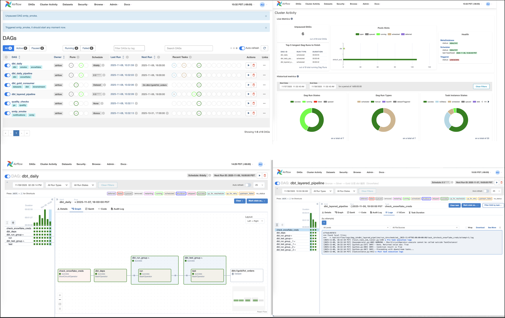
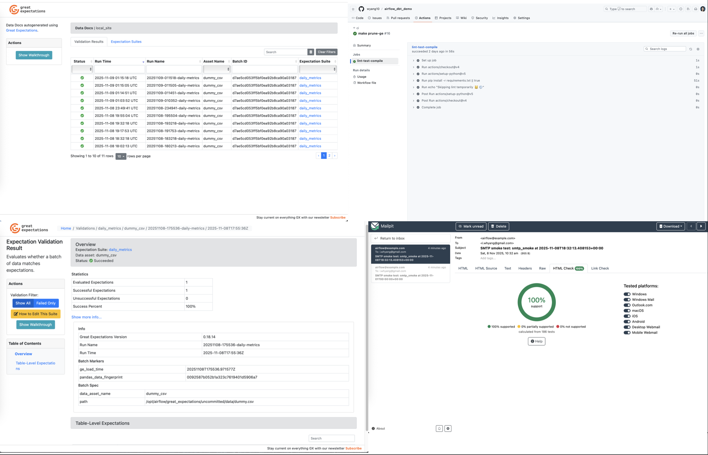
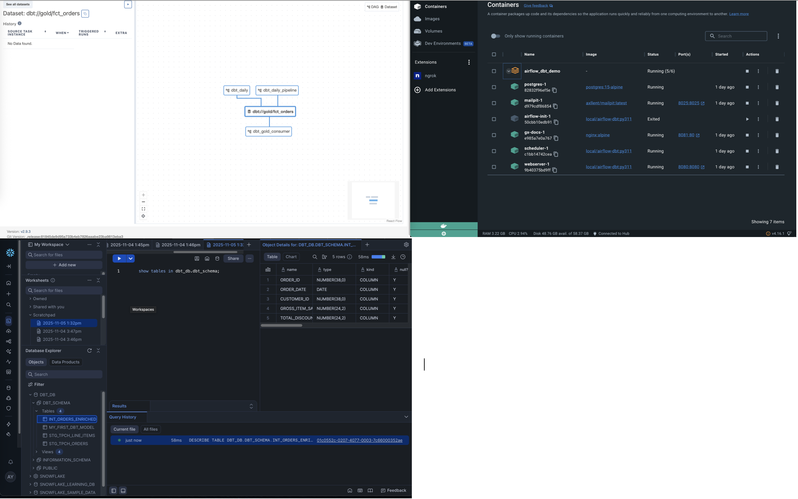

Airflow + dbt + Snowflake Data Orchestration Demo 🦊🐱

A production-ready template for scalable, governed ELT pipelines.

🚀 Overview

This project combines Apache Airflow (scheduling), dbt (transformation), and Great Expectations (data validation) into a single reproducible stack.
It demonstrates how to build a maintainable, high-quality ELT pipeline from ingestion to consumption, ready for both learning and production onboarding.

⸻

✨ Highlights

	•	Layered ELT Pipeline — Bronze → Silver → Gold modeling with dbt tests as automatic quality gates.
	•	Reusable Airflow TaskGroups wrapping dbt run/test commands to cut DAG boilerplate by >60%.
	•	Stability First: Airflow Pool dbt (serialized execution) prevents file race conditions in target/.
	•	Data Quality Automation: Great Expectations runs after each layer to validate schema & values.
	•	Event-Driven Scheduling: Publishes dataset dbt://gold/fct_orders for downstream subscriptions.
	•	Fast CI/CD: Fail-Fast Lint + cached dbt compile = feedback loop < 2 min.

⸻

Airflow DAGs 


Great Expectations Docs

 
CI/CD Overview


  
⸻

🧱 Stack

Component	Version / Role

- Airflow 2.9.3	Orchestration (Local Executor + Postgres metadata)
- dbt-core 1.10 + dbt-snowflake 1.10	SQL modeling & transformation
- Great Expectations 0.18	Data validation & docs
- Mailpit + Nginx	Local email testing & GE docs hosting
- Docker + Makefile	Reproducible startup & task automation


⸻

🧭 Architecture

flowchart LR

  A[Extract Bronze] --> B[Transform Silver]
  
  B --> C[Aggregate Gold]
  
  C --> D[Publish Dataset: dbt://gold/fct_orders]
  
  D --> E[Downstream Consumers]
  
  C --> F[Great Expectations Validation]


⸻

⚙️ Quick Start
```
# Clone & start
git clone https://github.com/wyang10/airflow_dbt_demo.git
cd airflow_dbt_demo
make up      # start containers and open Airflow UI
make validate # trigger sample DAGs

```

Runs locally on Docker Desktop ≥ 4.x (macOS 14 / Ubuntu 22.04 tested)

 

⸻

💡 Why This Repo

A clean reference for:

	•	🎓 Data engineers learning end-to-end ELT orchestration
	•	🧩 Teams building internal Airflow + dbt templates
	•	💼 Portfolio projects to show production-grade design thinking

⸻

🪪 License

MIT License · Use freely for learning and personal projects
